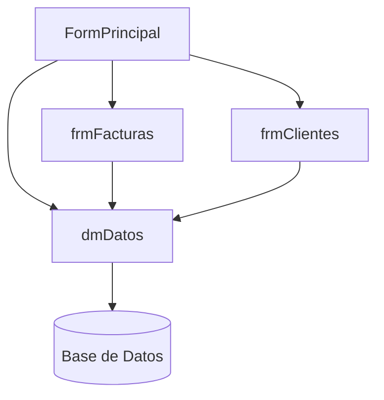

# Analizar Estructura de Proyecto

## Descripción

Mapea la estructura de un proyecto Delphi identificando dependencias, unidades y arquitectura.

## AI Context

> **SYSTEM_INSTRUCTION**: Analyze Delphi project structure. Map dependencies and architecture.
> **OUTPUT_FORMAT**: Markdown report with lists and optional Mermaid diagrams.
> **TOKEN_STRATEGY**: Focus on key files and relationships.

## Procedimiento de Análisis

### Paso 1: Identificar archivos clave

```text
1. Buscar archivos .dpr (proyecto principal)
2. Listar todos los .pas (unidades)
3. Identificar .dfm (formularios)
4. Localizar archivos de datos (.db, .sql)
```

### Paso 2: Extraer dependencias

Para cada archivo .pas, analizar la cláusula `uses`:

```pascal
// Ejemplo de extracción
uses
  // Unidades del sistema
  SysUtils, Classes, Forms,
  // Unidades del proyecto
  uClientes, uFacturas, uConfig,
  // Componentes externos
  mormot.core.base, ZeosDBO;
```

### Paso 3: Clasificar unidades

| Categoría | Patrón | Ejemplos |
| --------- | ------ | -------- |
| Formularios | `frm*`, `Form*` | `frmClientes`, `FormPrincipal` |
| DataModules | `dm*`, `Data*` | `dmDatos`, `DataModule1` |
| Lógica de negocio | `u*`, `Logic*` | `uFacturas`, `LogicVentas` |
| Utilidades | `util*`, `helper*` | `utilFechas`, `helperDB` |
| Configuración | `config*`, `settings*` | `configApp`, `settings` |

## Template de Informe

```markdown
# Análisis de Proyecto: [NOMBRE]

## Resumen
- **Archivo principal**: [archivo.dpr]
- **Total unidades**: [N]
- **Total formularios**: [N]
- **DataModules**: [N]

## Estructura de Directorios
```

Proyecto/
├── src/           # Código fuente
├── forms/         # Formularios
├── data/          # Archivos de datos
└── bin/           # Ejecutables

```

## Dependencias Principales

### Internas
- `uFacturas` → `uClientes`, `uProductos`
- `uClientes` → `uConfig`

### Externas
- mORMot2: Criptografía, REST
- ZeosDBO: Acceso a datos
- GmPrintSuite: Impresión

## Diagrama de Arquitectura



## Áreas de Mejora Detectadas

1. [Área 1]
2. [Área 2]

```

## Comandos de Análisis

### Listar todas las unidades uses

```bash
# En PowerShell
Get-ChildItem -Path ".\*.pas" -Recurse | ForEach-Object {
    Select-String -Path $_.FullName -Pattern "^\s*uses" -Context 0,20
}
```

### Contar líneas de código

```bash
# Total LOC
(Get-ChildItem -Path ".\*.pas" -Recurse | Get-Content | Measure-Object -Line).Lines
```

## Detección de Problemas

| Señal | Problema Potencial |
| ----- | ------------------ |
| Muchos uses | Acoplamiento alto |
| Formulario > 2000 líneas | Falta separar lógica |
| DataModule no usado | Código muerto |
| Dependencias circulares | Diseño problemático |

---

**Estado**: stable  
**Última revisión**: 2026-01-08
