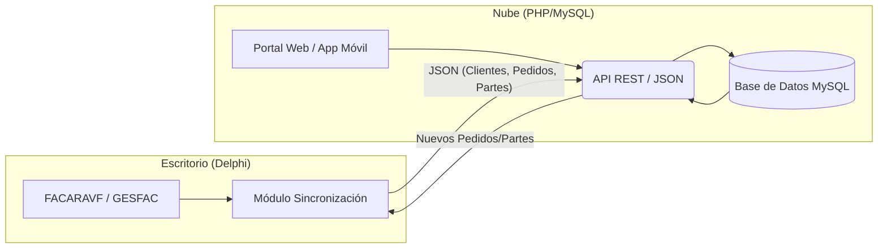

# Arquitectura Híbrida: Escritorio + Nube

Este documento define la estrategia para integrar las aplicaciones de escritorio ARAINFORIA (Delphi) con servicios en la nube (PHP/MySQL) para la **sincronización integral de negocio**.

## 🏗️ Modelo de Arquitectura Multi-Entidad

El sistema permite la sincronización bidireccional de cualquier entidad del sistema (Gestión, Facturación, Técnica).



## 🔄 Entidades Sincronizables

El sistema soportará operaciones CRUD (Crear, Leer, Actualizar, Borrar) para:

1.  **Gestión Comercial**:
    *   **Clientes/Proveedores**: Fichas completas, direcciones, contactos.
    *   **Artículos**: Stock, precios, familias.
    *   **Documentos**: Presupuestos, Pedidos, Albaranes, Facturas.

2.  **Gestión Técnica**:
    *   **Partes de Trabajo**: Horas, materiales, descripciones, firmas.
    *   **Intervenciones**: Estado, asignación a técnicos.
    *   **Activos/Maquinaria**: Historial de mantenimiento.

## 🔌 Tecnologías de Integración

### 1. Lado Escritorio (Delphi)
*   **Conectividad**: `System.Net.HttpClient` (Nativo).
*   **Patrón de Sincronización**:
    *   *Subida*: Cola de cambios locales pendientes de subir.
    *   *Bajada*: Polling o WebSockets (futuro) para recibir nuevos pedidos/partes web.
*   **Serialización**: Mapeo automático `DataSet` -> `JSON`.

### 2. Lado Nube (Backend PHP)
*   **Arquitectura MVC**: Controladores separados por entidad.
*   **Autenticación**: JWT (Json Web Tokens) para sesiones persistentes de técnicos/agentes.
*   **API**: RESTful estándar (`GET /clientes`, `POST /partes`, `PUT /pedidos/10`).

## 🛡️ Seguridad y Rendimiento

1.  **Validación**: La nube nunca confía ciegamente en el escritorio; valida tipos de datos y lógica de negocio básica.
2.  **Lotes (Batching)**: Enviar cambios en paquetes (ej: 50 artículos por petición) para no saturar la red.
3.  **Conflictos**: Estrategia de "Última escritura gana" o "Prioridad Servidor" configurable por entidad.

## 📂 Estructura de Ficheros Sugerida

```text
/
├── .skills/
├── FACARAVF/ (Desktop)
└── CLOUD_API/
    ├── public/
    │   └── index.php (Router)
    ├── src/
    │   ├── Controllers/
    │   │   ├── ClientesController.php
    │   │   ├── PartesController.php
    │   │   └── FacturasController.php
    │   ├── Models/
    │   │   ├── Cliente.php
    │   │   └── ParteTrabajo.php
    │   └── Core/
    │       ├── Database.php
    │       └── Auth.php
    └── db/
        └── schema_full.sql
```