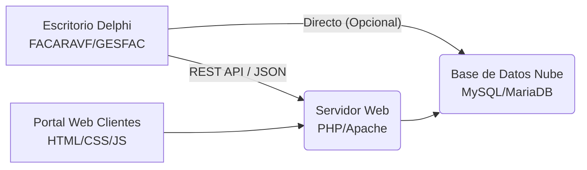

# Arquitectura Híbrida: Escritorio + Nube

Este documento define la estrategia para integrar las aplicaciones de escritorio ARAINFORIA (Delphi) con servicios en la nube (PHP/MySQL).

## 🏗️ Modelo de Arquitectura

El sistema evolucionará de una arquitectura **Monolítica Local** (Paradox/BDE) a una **Híbrida Conectada**.



## 🔌 Tecnologías de Integración

### 1. Lado Escritorio (Delphi)
*   **Conectividad HTTP**: Uso de `System.Net.HttpClient` (Nativo) o `Indy` (Legacy) para peticiones POST/GET.
*   **Conectividad BBDD**: `FireDAC` con drivers para MySQL/MariaDB (`libmysql.dll`).
*   **Intercambio de Datos**: Serialización JSON con `System.JSON`.

### 2. Lado Nube (Backend)
*   **Lenguaje**: PHP 8.x.
*   **API**: Endpoints sencillos para recepción de facturas, validación de licencias o backups.
*   **Base de Datos**: MariaDB 10.x / MySQL 8.0 (Estructura espejo o resumen de la local).

### 3. Lado Nube (Frontend)
*   **Tecnologías**: HTML5, CSS3 (Bootstrap/Tailwind), JavaScript vanilla.
*   **Uso**: Visualización de reportes, descarga de PDFs generados.

## 🛡️ Seguridad

1.  **Base de Datos**: Nunca exponer el puerto 3306 de MySQL directamente a internet si es posible. Preferir túnel SSH o intermediario PHP.
2.  **API**: Uso de Tokens (Bearer Token) o API Keys para autenticar la aplicación Delphi contra el servidor PHP.
3.  **SSL/TLS**: Todas las comunicaciones deben ir por HTTPS.

## 📂 Estructura de Ficheros Sugerida

```text
/
├── .skills/
├── FACARAVF/ (Desktop)
└── CLOUD_API/ (Nuevo)
    ├── public/
    │   ├── index.php
    │   └── css/
    ├── src/
    │   ├── Database.php
    │   └── FacturasController.php
    └── db/
        └── schema.sql
```
